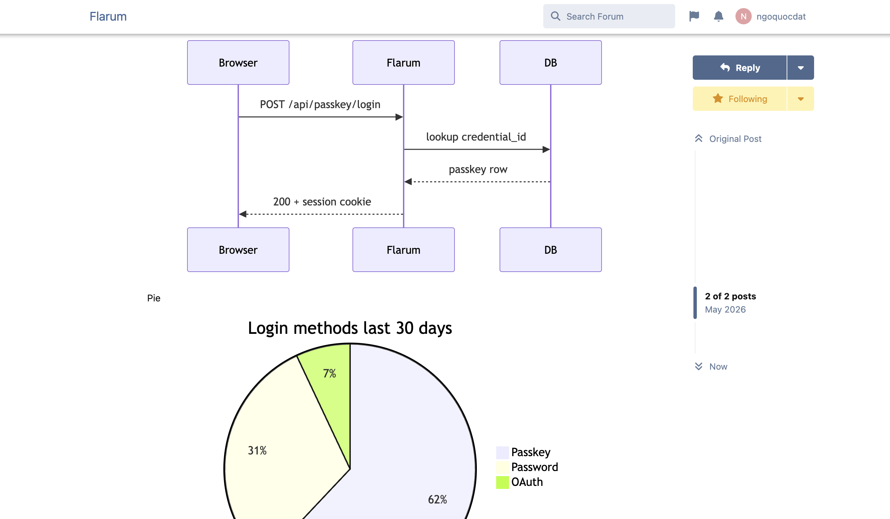
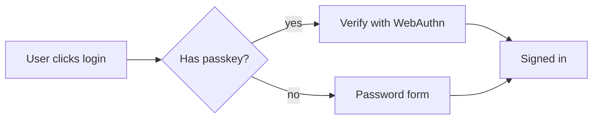

# Flarum Mermaid

[](LICENSE.md)
[](https://packagist.org/packages/datlechin/flarum-mermaid)
[](https://packagist.org/packages/datlechin/flarum-mermaid)
[](https://github.com/sponsors/datlechin)

A [Flarum](https://flarum.org) extension that renders [Mermaid](https://mermaid.js.org) diagrams inside posts.



## Example

````

````

## Settings

Diagrams match your forum out of the box. They use the font your forum uses for post text, take their colours from your forum, and follow light and dark mode as the reader switches. Two settings change that:

| Setting | Default | Description |
| --- | --- | --- |
| Diagram theme | Match forum theme | Takes the diagram colours from your forum. Mermaid's own themes (default, dark, neutral, forest) can be picked instead. |
| Font family | _(empty)_ | Any CSS font stack, such as `"Inter", system-ui, sans-serif`. Leave empty to use the forum's post font. |

## Installation

```sh
composer require datlechin/flarum-mermaid:"*"
```

## Updating

```sh
composer update datlechin/flarum-mermaid:"*"
php flarum cache:clear
```

## Sponsors

If this extension is useful to you, you can sponsor the work via [GitHub Sponsors](https://github.com/sponsors/datlechin) or [Buy Me a Coffee](https://buymeacoffee.com/ngoquocdat).

## Links

- [Packagist](https://packagist.org/packages/datlechin/flarum-mermaid)
- [GitHub](https://github.com/datlechin/flarum-mermaid)
- [Discuss](https://discuss.flarum.org/d/39236)
- [Mermaid](https://mermaid.js.org)
